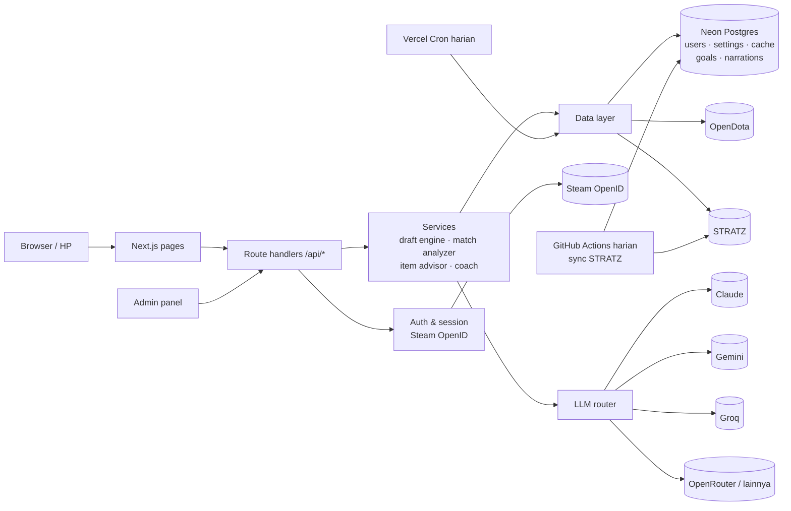

# Rencana Development: Pepak Doto

| | |
|---|---|
| Status | **Draft untuk direview** |
| Versi | 0.4 (2026-09-28) |
| Terkait | [PRD.md](PRD.md), [PROGRESS.md](PROGRESS.md) |

**Perubahan di 0.4:**
- Rincian Tahap 2 (§7), termasuk sinkron STRATZ harian lewat GitHub Actions.
- Bobot skor draft dari hasil backtest (§8).
- LLM utama sekarang Claude (Anthropic API, default Claude Haiku 4.5); LLM gratis jadi pilihan lain dan cadangan (§4).

**Perubahan di 0.3:**
- LLM hanya dari provider gratis.
- Ada justifikasi pilihan database (§2.1).
- Steam Web API key tidak wajib.
- Sebagian besar pertanyaan terbuka sudah terjawab.

**Perubahan di 0.2:**
- Hosting langsung di Vercel sejak Tahap 0.
- Database, login Steam, dan kerangka admin dimajukan ke Tahap 0, karena aplikasinya publik dan butuh akun.
- STRATZ jadi sumber utama draft.
- Arsitektur LLM dibuat bisa dikonfigurasi admin.
- Match Turbo dikecualikan.

---

## 1. Ringkasan

| Tahap | Isi | Fitur (PRD) | Ukuran | Status |
|---|---|---|---|---|
| **0. Fondasi** | Repo, deploy Vercel, database, login Steam, kerangka admin, layout, hero picker | F0, F11 (dasar) | M | ~25% (data layer sudah ada) |
| **1. MVP** | Draft Assistant (STRATZ) + Post-Match Analyzer | F1, F2 | L | – |
| **2. In-game** | Live Match Assistant (manual) + Cheat sheet | F3, F4 | L | – |
| **3. Profil pemain** | Tren, hero pool, target latihan, heatmap ward | F5–F8 | L | – |
| **4. Coaching LLM** | Provider LLM yang bisa dipilih admin + narasi | F9, F11 (LLM) | M | – |
| **5. Opsional** | GSI, fitur lanjutan, persiapan monetisasi | F10 | M | Perlu diskusi |

*Ukuran: S = kecil, M = sedang, L = besar (relatif, bukan estimasi hari).*

## 2. Tech stack

Semua layanan memakai **free tier**. Kolom terakhir menunjukkan jalur upgrade kalau user bertambah.

| Lapisan | Pilihan | Alasan | Jalur upgrade |
|---|---|---|---|
| Framework | **Next.js 16 (App Router)** + React 19 + TypeScript | Frontend + backend dalam satu project. *Sudah terpasang* | – |
| Styling / UI | **Tailwind CSS v4** + **shadcn/ui** | Cepat dan aksesibel | – |
| Hosting | **Vercel Hobby** | Deploy otomatis dari GitHub, preview per branch, HTTPS | Vercel Pro ($20/bln), **wajib sebelum monetisasi** |
| Database | **Postgres di Neon** (free tier, integrasi Vercel) + **Drizzle ORM**. Lokal: **PGlite** (Postgres embedded, tanpa server) | Butuh relasi (user, target, cache, setting). Postgres adalah standar yang mudah di-scale | Neon paket berbayar, atau Postgres lain (kode tetap sama karena Drizzle) |
| Cache | Tabel cache di Postgres + cache memori per instance | Di Vercel memori tidak awet, jadi DB jadi sumber cache | Upstash Redis (free tier juga ada) kalau DB mulai berat |
| Job terjadwal | **Vercel Cron** (Hobby: sekali sehari) | Refresh data meta (heroStats, matchup) tiap hari | Frekuensi lebih tinggi di Pro |
| Auth | **Steam OpenID 2.0** (implementasi kecil sendiri) + session cookie ter-signed (`jose`) | Steam memakai OpenID 2.0 yang tidak didukung bawaan Auth.js. Implementasinya pendek dan mudah diaudit | – |
| Data | OpenDota (REST), **STRATZ (GraphQL)**. Steam Web API opsional | Lihat PRD §9 | API key berbayar OpenDota |
| LLM | Interface `LlmProvider`: **Anthropic (Claude, utama)**, Gemini (free tier), Groq, OpenRouter, provider format OpenAI | Admin memilih model tanpa deploy ulang (F11) | Ganti ke model Claude yang lebih besar dari admin |
| Analytics | **Vercel Web Analytics** (tanpa cookie) | Gratis, tidak perlu banner cookie | – |
| Validasi | **Zod** | Input API dan respons eksternal | – |
| Data fetching client | **TanStack Query** | Debounce draft, polling parse | – |
| Grafik | Recharts (Tahap 3) | – | – |
| Testing | **Vitest** + **Playwright** | Logika inti berupa fungsi murni | CI GitHub Actions |
| Runtime | **Node.js 22 LTS** (di kedua laptop dan Vercel) | Sekarang 20.18. **Perlu upgrade** | – |

### 2.1 Pilihan database: Neon Postgres

**Data yang akan disimpan:**
- **Relasional:** user, preferensi, target latihan, ringkasan match per user, setting admin, dan log pemakaian LLM/API. Saling terhubung ke user.
- **Semi-terstruktur:** cache respons API (heroStats, matchup STRATZ, laporan match) dalam bentuk JSON.

Kebutuhan ini paling cocok dengan **database relasional yang juga kuat menyimpan JSON**, dan itu Postgres.

**Perbandingan free tier** (angka dari halaman harga/FAQ masing-masing, dicek ulang saat setup):

| | **Neon (Postgres)** | Supabase (Postgres) | Turso (SQLite) | MongoDB Atlas / Firebase |
|---|---|---|---|---|
| Storage gratis | 0,5 GB per project | 500 MB | 5 GB | 512 MB / 1 GB |
| Batas lain | 100 CU-jam/bulan, *scale to zero* | 2 project aktif | 500 jt baca, 10 jt tulis/bulan | – |
| **Dijeda saat sepi?** | Tidak. Hanya tidur dan bangun otomatis dalam ±0,5 detik | **Ya, dijeda setelah 1 minggu tanpa aktivitas** | Tidak | Tidak |
| Integrasi Vercel | Resmi (Marketplace, env var otomatis) | Ada | Ada | Terbatas |
| Cocok untuk data relasional | Ya | Ya | Ya | Kurang (NoSQL) |
| Pindah host nanti | Mudah, karena Postgres standar | Mudah | Perlu migrasi ke dialek lain | Sulit |
| Branch DB untuk development | **Ya** (salinan instan) | Berbayar | Ada | Tidak |

**Alasan memilih Neon:**
1. **Postgres adalah standar paling umum.** Kalau user bertambah, bisa pindah ke paket Neon berbayar atau Postgres di mana pun (Supabase, AWS, VPS) tanpa mengubah kode, karena kita memakai Drizzle ORM.
2. **Tidak dijeda saat sepi.** Di awal user masih sedikit, dan Supabase free bisa menjeda project setelah seminggu tanpa aktivitas. Neon hanya "tidur" lalu bangun otomatis saat ada request.
3. **Terintegrasi dengan Vercel.** Dipasang dari Vercel Marketplace, env var terisi otomatis, dan tersedia driver HTTP yang cocok untuk serverless.
4. **Branch database untuk dua laptop.** Development memakai branch terpisah dari data produksi, bisa diakses dari kedua laptop, dan bisa di-reset kapan saja.
5. **JSONB.** Cache respons API bisa disimpan tanpa tabel khusus untuk setiap bentuk data.

**Kelemahan dan cara mengatasinya:**
| Kelemahan | Mitigasi |
|---|---|
| Storage hanya 0,5 GB. JSON satu match mentah ±230 KB, jadi ±2.000 match sudah memenuhi storage | Yang disimpan permanen hanya **laporan ringkas** (±5–10 KB). JSON mentah hanya cache sementara dan dibersihkan otomatis oleh cron. Pemakaian storage tampil di panel admin |
| Cold start ±0,5 detik setelah DB tidur | Tertutup cache memori + respons halaman. Cron harian ikut "membangunkan" DB |
| Compute 100 CU-jam/bulan | Dengan *scale to zero* dan user sedikit, pemakaian jauh di bawah batas |

**Alternatif kalau storage jadi masalah sebelum siap bayar:** Turso (5 GB gratis). Drizzle mendukung keduanya, tapi pindah dari Postgres ke SQLite tetap butuh sedikit penyesuaian, jadi ini hanya rencana cadangan.

## 3. Arsitektur



**Prinsip:**
1. **Browser tidak memanggil API eksternal langsung.** Semua lewat `/api/*` (cache, keamanan key, kontrol kuota).
2. **Logika inti berupa fungsi murni** yang mudah dites dan tidak bergantung pada sumber data.
3. **Setiap sumber data dan LLM ada di balik interface**, jadi mudah diganti atau ditambah.
4. **LLM hanya lapisan presentasi.** Rekomendasi dan nilai sudah final sebelum LLM dipanggil.
5. **Semua yang bersifat konfigurasi disimpan di DB (tabel `app_settings`), sedangkan rahasia disimpan di environment variable.**

## 4. Desain LLM yang bisa dikonfigurasi admin

**Keputusan (diperbarui 2026-09-28): LLM utama adalah Claude lewat Anthropic API.** Admin tetap bisa mengganti model atau memindahkan LLM utama ke provider gratis tanpa deploy ulang.

**Model default: Claude Haiku 4.5** (`claude-haiku-4-5-20251001`). Alasannya:
- Tugasnya hanya menarasikan fakta yang sudah dihitung aplikasi (nilai, prioritas, item), bukan menganalisis dari nol. Model kecil sudah cukup.
- Paling murah dan paling cepat di keluarga Claude, jadi narasi tampil cepat dan biaya kecil.
- Kalau hasilnya terasa kurang, admin bisa naik ke **Claude Sonnet 5** (`claude-sonnet-5`) dari panel admin.

**Biaya:** Claude API berbayar per token dan butuh akun di Anthropic Console dengan kredit. Ini terpisah dari langganan claude.ai. Satu narasi kira-kira 2.000 token input + 400 token output. Dengan batas 200 narasi per hari, biaya bulanan tetap kecil; harga pastinya dicek ulang saat Tahap 4. Pengaman:
- batas belanja bulanan di Anthropic Console
- batas aplikasi 10 narasi per user dan 200 total per hari
- narasi di-cache, jadi match yang sama tidak dinarasikan dua kali
- kalau Claude error atau batas belanja habis, router pindah ke cadangan gratis

**Provider gratis sebagai pilihan lain dan cadangan** (batas dari sumber pihak ketiga, dicek ulang saat Tahap 4):

| Provider | Model gratis (contoh) | Kuota (perkiraan) | Peran default |
|---|---|---|---|
| **Google Gemini** (AI Studio, free tier) | Flash / Flash-Lite | ±1.500 request/hari | Cadangan 1 |
| **Groq** | gpt-oss-120b, dll. | ±1.000 request/hari per model | Cadangan 2. Sangat cepat |
| **OpenRouter** (model `:free`) | DeepSeek, Qwen, Llama | 50 request/hari (1.000 kalau pernah top-up $10) | Opsional |
| Provider format OpenAI lain | mis. Cerebras, Mistral | Bervariasi | Opsional, ditambah kalau perlu |

**Catatan privasi:** Anthropic tidak memakai data API untuk melatih model secara default. Free tier Gemini boleh dipakai Google untuk melatih model. Karena itu prompt hanya berisi statistik (tanpa nama, Steam ID, atau match ID), dan hal ini disebutkan di Privacy Policy.

**Komponen:**
| Komponen | Isi |
|---|---|
| `LlmProvider` (interface) | `id`, `models[]`, `isConfigured()` (key tersedia?), `generate(prompt, options)` |
| Implementasi | `anthropic` (SDK resmi Anthropic), `gemini` (SDK Google GenAI), `openai-compatible` (dipakai untuk Groq, OpenRouter, dan provider lain dengan base URL berbeda) |
| `app_settings.llm` (DB) | `{ enabled, primary: {provider, model}, fallbacks: [...], limits: {perUserPerDay, globalPerDay} }` |
| LLM router | Coba provider utama, lalu cadangan, lalu teks template. Mencatat pemakaian ke tabel `llm_usage` |
| Admin UI | Pilih provider/model, atur urutan cadangan, tombol Test, batas pemakaian, grafik pemakaian |

**Rahasia (API key) disimpan di environment variable Vercel**, bukan di DB. Admin UI hanya menampilkan status "configured / not configured". Batas default: 10 narasi per user per hari, 200 total per hari.

## 5. Struktur folder

```
pepak-doto/
├─ docs/                      PRD, rencana, progres
├─ data/                      (Tahap 2) sifat hero, aturan counter item, timer per patch
├─ drizzle/                   migrasi DB
├─ scripts/                   backtest draft, generator data sifat hero
├─ src/
│  ├─ app/
│  │  ├─ (public)/            beranda, draft, match, heroes, privacy
│  │  ├─ profile/             F0, F5–F8
│  │  ├─ admin/               F11
│  │  └─ api/                 route handlers (auth, draft, match, admin, cron)
│  ├─ components/
│  ├─ lib/
│  │  ├─ cache.ts ✅  dota.ts ✅  heroes.ts ✅  opendota/ ✅
│  │  ├─ stratz/              client GraphQL
│  │  ├─ steam/               OpenID (+ Web API opsional)
│  │  ├─ auth/                session, guard admin
│  │  ├─ db/                  schema Drizzle + query
│  │  ├─ draft/  match/  items/
│  │  └─ llm/                 providers + router
│  └─ hooks/
└─ tests/
```

## 6. Free tier dan kapan harus upgrade

| Layanan | Batas free (perkiraan, dicek saat setup) | Tanda harus upgrade |
|---|---|---|
| Vercel Hobby | Non-komersial; kuota bandwidth dan eksekusi function bulanan | Mulai monetisasi, atau kuota > 80% |
| Neon Postgres | 0,5 GB storage, 100 CU-jam/bulan, *scale to zero* | Storage > 80% atau cold start mengganggu |
| OpenDota | 3.000 request/hari, 60/menit | Rata-rata > 2.000/hari, lalu pakai API key berbayar |
| STRATZ | Batas per token (per detik, jam, hari) | Sering terkena rate limit |
| Claude API (berbayar) | Tidak ada free tier; dibatasi batas belanja di Anthropic Console | Tagihan mendekati batas belanja, lalu naikkan batas atau turunkan batas harian aplikasi |
| Gemini API (free tier) | Flash/Flash-Lite, kuota harian | Sering kena batas, lalu tambah provider cadangan atau pertimbangkan model berbayar |
| Groq / OpenRouter | Kuota harian gratis | Sering habis, lalu naikkan batas atau pakai model berbayar |

Pemakaian semua layanan ini ditampilkan di **panel admin** (F11) agar keputusan upgrade berdasarkan data.

## 7. Rincian tahap

### Tahap 0: Fondasi
| # | Tugas | Status |
|---|---|---|
| 0.1 | Scaffold Next.js + TS + Tailwind | ✅ |
| 0.2 | Client OpenDota + cache + tipe data | ✅ (cache 2 lapis: memori + DB) |
| 0.3 | Helper Dota (bracket, posisi, CDN, Steam ID) | ✅ |
| 0.4 | Repo GitHub `fazarashif/pepak-doto` + README | ✅ |
| 0.5 | Upgrade Node 22 di kedua laptop; install Zod, TanStack Query, Vitest, Prettier, Drizzle, jose | ✅ (Node 22 dan TanStack Query menyusul) |
| 0.6 | Hubungkan repo ke Vercel, setup Neon via Vercel Marketplace, env vars | ⏳ menunggu pemilik |
| 0.7 | Schema DB awal: `users`, `app_settings`, `api_cache`, `api_usage` + migrasi | ✅ |
| 0.8 | Login Steam (OpenID) + session + logout + hapus akun | ✅ |
| 0.9 | Guard admin (`ADMIN_STEAM_IDS`) + halaman admin kosong (status layanan) | ✅ |
| 0.10 | Layout (tema gelap, navigasi, footer dengan disclaimer Valve), halaman Privacy | ✅ |
| 0.11 | Halaman profil + pengaturan bracket/posisi | ✅ |
| 0.12 | Komponen `HeroPortrait` + `HeroPicker` | ✅ |
| 0.13 | Client STRATZ + tes query matchup dengan token | ✅ |
| 0.14 | Penanganan error API yang ramah | ✅ |

**Selesai bila:** aplikasi live di Vercel, bisa login Steam, profil tersimpan, admin bisa membuka `/admin`, hero picker berfungsi, dan test jalan.

### Tahap 1: MVP: Draft Assistant + Post-Match Analyzer
| # | Tugas | Status |
|---|---|---|
| 1.1 | `draft/engine.ts`: counter + synergy (STRATZ), meta, hero pool, komposisi, posisi, ban, peringatan. Rumus di §8 | ✅ |
| 1.2 | Sumber data: STRATZ (utama), OpenDota (cadangan) | ✅ (`draft/data.ts`) |
| 1.3 | Vercel Cron: refresh heroStats + data matchup STRATZ tiap hari ke DB | Dipindah ke Tahap 2.1 (GitHub Actions), karena batas IP STRATZ |
| 1.4 | `POST /api/draft` + halaman `/draft` | ✅ |
| 1.5 | Unit test engine + script backtest | ✅ (`npm run backtest`, hasil di PROGRESS.md) |
| 1.6 | `match/analyze.ts`: nilai, laning, kematian, waktu item, vision, prioritas perbaikan. **Turbo ditolak** | ✅ |
| 1.7 | Match (detail, parse, recent tanpa Turbo) + halaman `/match` dan `/match/[id]` | ✅ (server component + server action, tanpa API terpisah) |
| 1.8 | Unit test analyzer + smoke test E2E | ✅ test, ⬜ E2E |

### Tahap 2: In-game
Keputusan: D20–D24 di PRD §11.

| # | Tugas | Status |
|---|---|---|
| 2.1 | **Sinkron data hero harian.** `scripts/sync-hero-data.ts` mengambil data STRATZ (matchup, posisi, build item, statistik damage) dan winrate per durasi dari OpenDota, lalu menulis ke tabel `hero_data` di Neon. Query digabung dengan alias GraphQL (10 hero per request). Dijalankan GitHub Actions setiap hari (`.github/workflows/sync-hero-data.yml`), dan bisa manual (`npm run sync:hero-data`). Di Vercel aplikasi tidak memanggil STRATZ langsung; di laptop data diambil saat dibutuhkan | ✅ |
| 2.2 | Draft assistant membaca data hasil sinkron. Kalau belum ada, pakai cadangan OpenDota seperti sekarang | ✅ |
| 2.3 | `data/hero-traits.json`: sifat yang tidak ada di statistik (ilusi, evasion, ultimate menembus BKB, buff yang bisa di-dispel, summon, silence, mana burn, dll.). Draf dari script (`scripts/draft-hero-traits.ts`, dari deskripsi skill OpenDota), lalu direview. Diberi versi patch | ⬜ |
| 2.4 | `data/counter-items.json`: ±20 aturan "sifat musuh → item", dibedakan untuk core dan support | ⬜ |
| 2.5 | `items/advisor.ts`: build inti per fase, item situasional + alasan, target waktu item, penyesuaian ahead/even/behind, item yang sudah dimiliki dicoret. Unit test | ⬜ |
| 2.6 | `plan/game-plan.ts`: kurva kekuatan tim per durasi, komposisi damage musuh, skill berbahaya. Unit test | ⬜ |
| 2.7 | Halaman `/live` (mobile-first) + tombol "Start game plan" di `/draft` | ⬜ |
| 2.8 | Cheat sheet `/heroes/[id]` (data saja) | ⬜ |
| 2.9 | Checklist update data per patch di `docs/` | ⬜ |
| – | Timer manual + pengingat | Ditunda (D22) |

**Yang perlu disiapkan pemilik:** secret `STRATZ_TOKEN` dan `DATABASE_URL` (Neon production) di GitHub. Panduan: [SETUP.md bagian G](SETUP.md#g-sinkron-data-hero-harian-github-actions).

**Perkiraan beban sinkron:** ±127 hero × rata-rata 2 posisi × 4 bracket untuk data item, ditambah 508 query matchup. Dengan alias GraphQL jadi ratusan request per hari, jauh di bawah batas STRATZ 15.000/hari. Datanya diringkas sebelum disimpan (beberapa MB), aman untuk batas 0,5 GB Neon.

**Selesai bila:** dari draft yang lengkap, `/live` menampilkan build, item situasional dengan alasan, dan rencana permainan di HP tanpa memanggil STRATZ langsung; cheat sheet tampil untuk semua hero; sinkron harian berjalan di GitHub Actions.

### Tahap 3: Profil pemain
| # | Tugas |
|---|---|
| 3.1 | Tabel `match_summaries`, `goals`; sinkron riwayat match (tanpa Turbo) |
| 3.2 | Tren (F5) |
| 3.3 | Hero pool (F6) |
| 3.4 | Target latihan (F7) |
| 3.5 | Heatmap ward (F8) |

### Tahap 4: Coaching LLM
| # | Tugas |
|---|---|
| 4.1 | Interface `LlmProvider` + implementasi Anthropic (Claude), Gemini, dan OpenAI-compatible |
| 4.2 | LLM router: cadangan, batas pemakaian, pencatatan ke `llm_usage` |
| 4.3 | Admin UI: pilih model, urutan cadangan, Test, batas, grafik pemakaian |
| 4.4 | Prompt berbasis fakta (diberi versi) + narasi post-match, tren, cheat sheet |
| 4.5 | Cache narasi di DB + evaluasi sederhana (tidak menyebut hero atau item di luar data) |

### Tahap 5: Opsional
- GSI (diskusi dulu).
- Persiapan monetisasi (upgrade hosting, syarat dan ketentuan).
- Monitoring error (mis. Sentry free tier) dan analytics.

## 8. Rumus inti (untuk direview)

```
counter(c)   = rata-rata atas musuh e: keunggulan(c vs e)     ← STRATZ per bracket
synergy(c)   = rata-rata atas kawan a: synergy(c dengan a)    ← STRATZ
meta(c)      = winrate_halus(c di bracket) − 50%
pool(c)      = 0,5 × (winrate_pribadi_halus − 50%) + 2% × min(1, game/30)
komposisi(c) = +1% per kebutuhan tim yang diisi
skor         = 1,0·counter + 0,2·synergy + 0,5·meta + komposisi + pool
```
- *winrate_halus* = (menang + k·50%) / (game + k), supaya sampel kecil tidak ekstrem.
- Bobot dikalibrasi dengan backtest (3.899 match, lihat PROGRESS.md). Awalnya 1 / 0,6 / 0,7.
- **Nilai post-match:** A ≥ persentil 75, B ≥ 50, C ≥ 25, D < 25. Persentil kematian dari OpenDota sudah "makin tinggi makin baik", jadi **tidak** dibalik.
- **Meta dan filter posisi** memakai data STRATZ per posisi per bracket. Hero dengan < 10% game di posisi yang dipilih disembunyikan.
- **Waktu item** hanya dibandingkan dengan bucket yang lebih cepat dari waktu pemain.

## 9. Bekerja dari dua laptop
1. Kedua laptop: install **Node 22 LTS**, Git, dan GitHub CLI, lalu `git clone https://github.com/fazarashif/pepak-doto.git`.
2. Rahasia (`.env.local`) **tidak** masuk Git. Ambil dari Vercel dengan `npx vercel link` lalu `npx vercel env pull .env.local`. Setelah itu kedua laptop memakai env yang sama.
3. Database dipakai bersama di Neon, dengan branch database terpisah untuk development (fitur Neon), jadi tidak mengganggu data produksi.
4. Selalu `git pull` sebelum mulai dan `git push` setelah selesai. Kerjakan fitur di branch sendiri.
5. Status pekerjaan dicatat di `docs/PROGRESS.md`, jadi di laptop mana pun bisa langsung lanjut.

## 10. Cara kerja dan kualitas
- **Git:** `main` selalu bisa di-deploy. Fitur dikerjakan di branch `feat/...` lalu PR ke `main`. Vercel membuat preview untuk tiap PR.
- **Commit dan PR** ditulis dengan bahasa manusia biasa, singkat dan jelas.
- **Definition of Done:** type-check dan lint lulus, unit test untuk logika baru, dicoba di desktop dan lebar HP, dan `PROGRESS.md` diperbarui.
- **Akhir tiap tahap:** demo + review sebelum lanjut.
- **Tiap patch Dota besar dan tiap tahun:** checklist update data + perpanjang token STRATZ (berlaku 1 tahun).

## 11. Pertanyaan terbuka

Keputusan yang sudah diambil tercatat di [PRD §11](PRD.md#11-keputusan-yang-sudah-diambil). Yang masih terbuka:

| # | Pertanyaan | Usulan |
|---|---|---|
| Q8 | Bahasa di repo: dokumen `docs/` tetap Bahasa Indonesia, sedangkan README, pesan commit, dan PR dalam Bahasa Inggris? | Ya |
