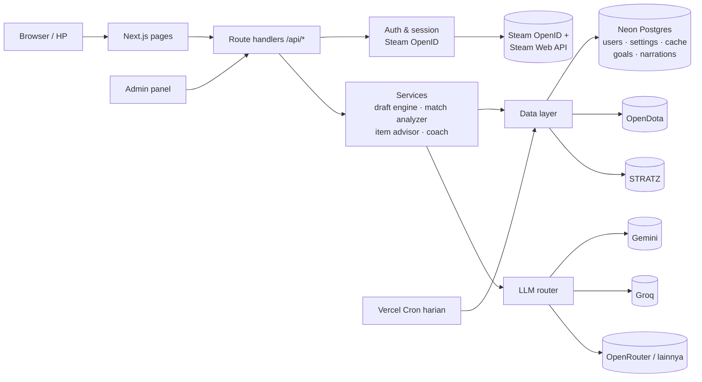

# Rencana Development: Pepak Doto

| | |
|---|---|
| Status | **Draft untuk direview** |
| Versi | 0.2 (2026-09-27) |
| Terkait | [PRD.md](PRD.md), [PROGRESS.md](PROGRESS.md) |

**Perubahan dari 0.1:**
- Hosting langsung di Vercel sejak Tahap 0.
- Database, login Steam, dan kerangka admin dimajukan ke Tahap 0, karena aplikasinya publik dan butuh akun.
- STRATZ jadi sumber utama draft.
- Arsitektur LLM dibuat bisa dikonfigurasi admin.
- Match Turbo dikecualikan.

---

## 1. Ringkasan

| Tahap | Isi | Fitur (PRD) | Ukuran | Status |
|---|---|---|---|---|
| **0. Fondasi** | Repo, deploy Vercel, database, login Steam, kerangka admin, layout, hero picker | F0, F11 (dasar) | M | ~25% (data layer sudah ada) |
| **1. MVP** | Draft Assistant (STRATZ) + Post-Match Analyzer | F1, F2 | L | – |
| **2. In-game** | Live Match Assistant (manual) + Cheat sheet | F3, F4 | L | – |
| **3. Profil pemain** | Tren, hero pool, target latihan, heatmap ward | F5–F8 | L | – |
| **4. Coaching LLM** | Provider LLM yang bisa dipilih admin + narasi | F9, F11 (LLM) | M | – |
| **5. Opsional** | GSI, fitur lanjutan, persiapan monetisasi | F10 | M | Perlu diskusi |

*Ukuran: S = kecil, M = sedang, L = besar (relatif, bukan estimasi hari).*

## 2. Tech stack

Semua layanan memakai **free tier**. Kolom terakhir menunjukkan jalur upgrade kalau user bertambah.

| Lapisan | Pilihan | Alasan | Jalur upgrade |
|---|---|---|---|
| Framework | **Next.js 16 (App Router)** + React 19 + TypeScript | Frontend + backend dalam satu project. *Sudah terpasang* | – |
| Styling / UI | **Tailwind CSS v4** + **shadcn/ui** | Cepat dan aksesibel | – |
| Hosting | **Vercel Hobby** | Deploy otomatis dari GitHub, preview per branch, HTTPS | Vercel Pro ($20/bln), **wajib sebelum monetisasi** |
| Database | **Postgres di Neon** (free tier, integrasi Vercel) + **Drizzle ORM** | Butuh relasi (user, target, cache, setting). Postgres adalah standar yang mudah di-scale | Neon paket berbayar, atau Postgres lain (kode tetap sama karena Drizzle) |
| Cache | Tabel cache di Postgres + cache memori per instance | Di Vercel memori tidak awet, jadi DB jadi sumber cache | Upstash Redis (free tier juga ada) kalau DB mulai berat |
| Job terjadwal | **Vercel Cron** (Hobby: sekali sehari) | Refresh data meta (heroStats, matchup) tiap hari | Frekuensi lebih tinggi di Pro |
| Auth | **Steam OpenID 2.0** (implementasi kecil sendiri) + session cookie ter-signed (`jose`) | Steam memakai OpenID 2.0 yang tidak didukung bawaan Auth.js. Implementasinya pendek dan mudah diaudit | – |
| Data | OpenDota (REST), **STRATZ (GraphQL)**, Steam Web API | Lihat PRD §9 | API key berbayar OpenDota |
| LLM | Interface `LlmProvider`: Gemini, Groq, OpenRouter, provider format OpenAI | Admin memilih model tanpa deploy ulang (F11) | Tambah provider baru cukup satu file |
| Validasi | **Zod** | Input API dan respons eksternal | – |
| Data fetching client | **TanStack Query** | Debounce draft, polling parse | – |
| Grafik | Recharts (Tahap 3) | – | – |
| Testing | **Vitest** + **Playwright** | Logika inti berupa fungsi murni | CI GitHub Actions |
| Runtime | **Node.js 22 LTS** (di kedua laptop dan Vercel) | Sekarang 20.18. **Perlu upgrade** | – |

## 3. Arsitektur



**Prinsip:**
1. **Browser tidak memanggil API eksternal langsung.** Semua lewat `/api/*` (cache, keamanan key, kontrol kuota).
2. **Logika inti berupa fungsi murni** yang mudah dites dan tidak bergantung pada sumber data.
3. **Setiap sumber data dan LLM ada di balik interface**, jadi mudah diganti atau ditambah.
4. **LLM hanya lapisan presentasi.** Rekomendasi dan nilai sudah final sebelum LLM dipanggil.
5. **Semua yang bersifat konfigurasi disimpan di DB (tabel `app_settings`), sedangkan rahasia disimpan di environment variable.**

## 4. Desain LLM yang bisa dikonfigurasi admin

**Soal Gemini Pro milik admin:** langganan Google AI Pro **tidak memberikan kuota API**. Menurut dokumentasi Google, benefit langganan hanya berlaku di antarmuka web Google AI Studio. Yang *bisa* dipakai:
- **Kredit Google Cloud $10/bulan** dari Google Developer Program (termasuk dalam AI Pro). Kredit ini bisa dipakai untuk biaya **Gemini API**, termasuk model Pro. Syaratnya: klaim benefit, buat project Google Cloud, dan **aktifkan billing** (kartu kredit).
- API key dibuat di Google AI Studio dengan akun yang sama.
- Model Flash tetap bisa dipakai di free tier tanpa billing.

**Komponen:**
| Komponen | Isi |
|---|---|
| `LlmProvider` (interface) | `id`, `models[]`, `isConfigured()` (key tersedia?), `generate(prompt, options)` |
| Implementasi | `gemini` (SDK Google GenAI), `openai-compatible` (dipakai untuk Groq, OpenRouter, dan provider lain dengan base URL berbeda) |
| `app_settings.llm` (DB) | `{ enabled, primary: {provider, model}, fallbacks: [...], limits: {perUserPerDay, globalPerDay} }` |
| LLM router | Coba provider utama, lalu cadangan, lalu teks template. Mencatat pemakaian ke tabel `llm_usage` |
| Admin UI | Pilih provider/model, atur urutan cadangan, tombol Test, batas pemakaian, grafik pemakaian |

**Rahasia (API key) disimpan di environment variable Vercel**, bukan di DB. Admin UI hanya menampilkan status "configured / not configured". Ini perlu dikonfirmasi (Q4).

## 5. Struktur folder

```
pepak-doto/
├─ docs/                      PRD, rencana, progres
├─ data/                      (Tahap 2) sifat hero, aturan counter item, timer per patch
├─ drizzle/                   migrasi DB
├─ scripts/                   backtest draft, generator data sifat hero
├─ src/
│  ├─ app/
│  │  ├─ (public)/            beranda, draft, match, heroes, privacy
│  │  ├─ profile/             F0, F5–F8
│  │  ├─ admin/               F11
│  │  └─ api/                 route handlers (auth, draft, match, admin, cron)
│  ├─ components/
│  ├─ lib/
│  │  ├─ cache.ts ✅  dota.ts ✅  heroes.ts ✅  opendota/ ✅
│  │  ├─ stratz/              client GraphQL
│  │  ├─ steam/               OpenID + Web API
│  │  ├─ auth/                session, guard admin
│  │  ├─ db/                  schema Drizzle + query
│  │  ├─ draft/  match/  items/
│  │  └─ llm/                 providers + router
│  └─ hooks/
└─ tests/
```

## 6. Free tier dan kapan harus upgrade

| Layanan | Batas free (perkiraan, dicek saat setup) | Tanda harus upgrade |
|---|---|---|
| Vercel Hobby | Non-komersial; kuota bandwidth dan eksekusi function bulanan | Mulai monetisasi, atau kuota > 80% |
| Neon Postgres | Storage kecil (±0,5 GB), compute terbatas, *scale to zero* | Storage > 80% atau cold start mengganggu |
| OpenDota | 3.000 request/hari, 60/menit | Rata-rata > 2.000/hari, lalu pakai API key berbayar |
| STRATZ | Batas per token (per detik, jam, hari) | Sering terkena rate limit |
| Gemini API | Flash: free tier. Pro: dari kredit $10/bln | Kredit habis sebelum akhir bulan |
| Groq / OpenRouter | Kuota harian gratis | Sering habis, lalu naikkan batas atau pakai model berbayar |

Pemakaian semua layanan ini ditampilkan di **panel admin** (F11) agar keputusan upgrade berdasarkan data.

## 7. Rincian tahap

### Tahap 0: Fondasi
| # | Tugas | Status |
|---|---|---|
| 0.1 | Scaffold Next.js + TS + Tailwind | ✅ |
| 0.2 | Client OpenDota + cache + tipe data | ✅ (cache perlu disesuaikan ke DB) |
| 0.3 | Helper Dota (bracket, posisi, CDN, Steam ID) | ✅ |
| 0.4 | Repo GitHub `fazarashif/pepak-doto` + README | ⏳ sedang dikerjakan |
| 0.5 | Upgrade Node 22 di kedua laptop; install Zod, TanStack Query, Vitest, Prettier, Drizzle, jose | ⬜ |
| 0.6 | Hubungkan repo ke Vercel, setup Neon via Vercel Marketplace, env vars | ⬜ |
| 0.7 | Schema DB awal: `users`, `app_settings`, `api_cache`, `api_usage` + migrasi | ⬜ |
| 0.8 | Login Steam (OpenID) + session + logout + hapus akun | ⬜ |
| 0.9 | Guard admin (`ADMIN_STEAM_IDS`) + halaman admin kosong (status layanan) | ⬜ |
| 0.10 | Layout (tema gelap, navigasi, footer dengan disclaimer Valve), halaman Privacy | ⬜ |
| 0.11 | Halaman profil + pengaturan bracket/posisi | ⬜ |
| 0.12 | Komponen `HeroPortrait` + `HeroPicker` | ⬜ |
| 0.13 | Client STRATZ + tes query matchup dengan token | ⬜ |
| 0.14 | Penanganan error API yang ramah | ⬜ |

**Selesai bila:** aplikasi live di Vercel, bisa login Steam, profil tersimpan, admin bisa membuka `/admin`, hero picker berfungsi, dan test jalan.

### Tahap 1: MVP: Draft Assistant + Post-Match Analyzer
| # | Tugas |
|---|---|
| 1.1 | `draft/engine.ts`: counter + synergy (STRATZ), meta, hero pool, komposisi, posisi, ban, peringatan. Rumus di §8 |
| 1.2 | `MatchupProvider`: STRATZ (utama), OpenDota (cadangan) |
| 1.3 | Vercel Cron: refresh heroStats + data matchup STRATZ tiap hari ke DB |
| 1.4 | `POST /api/draft` + halaman `/draft` |
| 1.5 | Unit test engine + script backtest |
| 1.6 | `match/analyze.ts`: nilai, laning, kematian, waktu item, vision, prioritas perbaikan. **Turbo ditolak** |
| 1.7 | API match (detail, parse, recent tanpa Turbo) + halaman `/match` dan `/match/[id]` |
| 1.8 | Unit test analyzer + smoke test E2E |

### Tahap 2: In-game
| # | Tugas |
|---|---|
| 2.1 | `data/hero-traits.json` (draf dari script, review manual) |
| 2.2 | `data/counter-items.json` |
| 2.3 | `items/advisor.ts`: build inti, item situasional, target waktu item |
| 2.4 | Rencana permainan (kurva winrate per durasi, gaya tim) |
| 2.5 | Halaman `/live`, hero dibawa dari draft |
| 2.6 | (Opsional) timer manual + pengingat |
| 2.7 | Cheat sheet `/heroes/[id]` |
| 2.8 | Checklist update data per patch |

### Tahap 3: Profil pemain
| # | Tugas |
|---|---|
| 3.1 | Tabel `match_summaries`, `goals`; sinkron riwayat match (tanpa Turbo) |
| 3.2 | Tren (F5) |
| 3.3 | Hero pool (F6) |
| 3.4 | Target latihan (F7) |
| 3.5 | Heatmap ward (F8) |

### Tahap 4: Coaching LLM
| # | Tugas |
|---|---|
| 4.1 | Interface `LlmProvider` + implementasi Gemini dan OpenAI-compatible |
| 4.2 | LLM router: cadangan, batas pemakaian, pencatatan ke `llm_usage` |
| 4.3 | Admin UI: pilih model, urutan cadangan, Test, batas, grafik pemakaian |
| 4.4 | Prompt berbasis fakta (diberi versi) + narasi post-match, tren, cheat sheet |
| 4.5 | Cache narasi di DB + evaluasi sederhana (tidak menyebut hero atau item di luar data) |

### Tahap 5: Opsional
- GSI (diskusi dulu).
- Persiapan monetisasi (upgrade hosting, syarat dan ketentuan).
- Monitoring error (mis. Sentry free tier) dan analytics.

## 8. Rumus inti (untuk direview)

```
counter(c)   = rata-rata atas musuh e: keunggulan(c vs e)     ← STRATZ per bracket
synergy(c)   = rata-rata atas kawan a: synergy(c dengan a)    ← STRATZ
meta(c)      = winrate_halus(c di bracket) − 50%
pool(c)      = 0,5 × (winrate_pribadi_halus − 50%) + 2% × min(1, game/30)
komposisi(c) = +1% per kebutuhan tim yang diisi
skor         = 1,0·counter + 0,6·synergy + 0,7·meta + komposisi + pool
```
- *winrate_halus* = (menang + k·50%) / (game + k), supaya sampel kecil tidak ekstrem.
- Bobot dikalibrasi dengan backtest.
- **Nilai post-match:** A ≥ persentil 75, B ≥ 50, C ≥ 25, D < 25. Untuk kematian, persentil dibalik.

## 9. Bekerja dari dua laptop
1. Kedua laptop: install **Node 22 LTS**, Git, dan GitHub CLI, lalu `git clone https://github.com/fazarashif/pepak-doto.git`.
2. Rahasia (`.env.local`) **tidak** masuk Git. Ambil dari Vercel dengan `npx vercel link` lalu `npx vercel env pull .env.local`. Setelah itu kedua laptop memakai env yang sama.
3. Database dipakai bersama di Neon, dengan branch database terpisah untuk development (fitur Neon), jadi tidak mengganggu data produksi.
4. Selalu `git pull` sebelum mulai dan `git push` setelah selesai. Kerjakan fitur di branch sendiri.
5. Status pekerjaan dicatat di `docs/PROGRESS.md`, jadi di laptop mana pun bisa langsung lanjut.

## 10. Cara kerja dan kualitas
- **Git:** `main` selalu bisa di-deploy. Fitur dikerjakan di branch `feat/...` lalu PR ke `main`. Vercel membuat preview untuk tiap PR.
- **Commit dan PR** ditulis dengan bahasa manusia biasa, singkat dan jelas.
- **Definition of Done:** type-check dan lint lulus, unit test untuk logika baru, dicoba di desktop dan lebar HP, dan `PROGRESS.md` diperbarui.
- **Akhir tiap tahap:** demo + review sebelum lanjut.
- **Tiap patch Dota besar dan tiap tahun:** checklist update data + perpanjang token STRATZ (berlaku 1 tahun).

## 11. Pertanyaan terbuka

Untuk tiap pertanyaan saya tuliskan usulan saya. Anda tinggal setuju atau memilih lain.

| # | Pertanyaan | Usulan |
|---|---|---|
| Q1 | Apakah user **tanpa login** boleh memakai Draft dan Post-Match? | Ya. Login hanya wajib untuk fitur personal (hero pool, recent matches, tren, target) |
| Q2 | Siapa saja admin? Cukup Anda, atau nanti bisa lebih dari satu? | Daftar Steam ID admin di env var; awalnya hanya Anda |
| Q3 | Pilihan LLM satu untuk semua fitur, atau bisa beda per fitur? | Satu model utama + cadangan. Per fitur menyusul kalau dibutuhkan |
| Q4 | API key LLM diisi lewat env var Vercel (lebih aman) atau lewat UI admin (disimpan terenkripsi di DB)? | Env var Vercel |
| Q5 | Bersedia mengaktifkan **billing Google Cloud** agar kredit $10/bln bisa dipakai untuk Gemini Pro? Berapa batas maksimal biaya per bulan? | Ya, dengan budget alert di $10 |
| Q6 | Batas narasi LLM per user per hari? | 5 per user, 200 total per hari |
| Q7 | Domain: `pepak-doto.vercel.app` atau domain sendiri? | Mulai dengan `.vercel.app` |
| Q8 | Bahasa dokumen di repo: docs Bahasa Indonesia + README Bahasa Inggris? | Ya |
| Q9 | Apakah Anda punya akun Steam non-limited untuk membuat **Steam Web API key**? | – |
| Q10 | Database: setuju **Neon Postgres** (usulan) atau ada preferensi lain (Supabase, Turso)? | Neon |
| Q11 | Perlu analytics pengunjung (Vercel Web Analytics, gratis)? | Ya, tanpa cookie |
